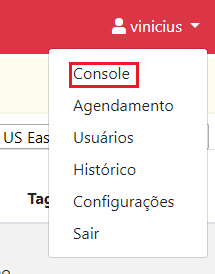

# Console

> :sparkles: **Observação**: para mudar o idioma da interface gráfica, utilize a caixa de seleção no canto inferior esquerdo da tela.

Clique no menu no canto superior direito da tela. Então clique em `Console`.

Em `Instâncias` estão listadas as instâncias EC2 e RDS criadas em sua conta AWS.
O menu de seleção a direita muda a região da qual as instâncias devem ser listadas, por exemplo, US East (N. Virginia) ou South America (São Paulo). Clique em `List instances` para atualizar a lista.

## O que são ambientes?

Para a plataforma EC2 Management, ambientes são grupos de uma ou mais instâncias. As ações são realizadas sobre esses ambientes.

O porque uma instância faz parte de um ambiente depende do usuário que criou esse ambiente.
É esse usuário que conhece sua infraestrutura e sabe o porque determinadas instâncias devem sofrer as mesmas ações ao mesmo tempo.

## Tags na AWS

A AWS possui um sistema de **Tags** para ajudá-lo a gerenciar instâncias, imagens e outros recursos da Amazon Web Services.

Como descrito na [documentação oficial](https://docs.aws.amazon.com/pt_br/AWSEC2/latest/UserGuide/Using_Tags.html), Tag é um rótulo que você atribui a um recurso da AWS. Cada tag consiste de uma _chave_ e um _valor_ opcional, ambos definidos por você.

As tags permitem categorizar seus recursos da AWS de diferentes formas (como por finalidade, por proprietário ou por ambiente).
Isso é útil quando você tem muitos recursos do mesmo tipo — é possível identificar rapidamente um recurso específico baseado nas tags que você atribuiu a ele.
Por exemplo, você pode definir um conjunto de tags para as instâncias do Amazon EC2 da sua conta que lhe ajudem a rastrear o proprietário e o nível do stack de cada instância.

As _chaves_ e os _valores_ de tags diferenciam maiúsculas de minúsculas.
Ou seja, o par `chave=SO/valor=Linux` é diferente do par `chave=So/valor=linux` que é diferente do par `chave=SO/valor=LiNuX`.
Assim, cada um desses pares formará um ambiente diferente, como explicado futuramente nesse tutorial.

## Criando um ambiente

> :grey_exclamation: Caso não esteja vendo as instâncias que deseja, verifique a região selecionada.

> :page_facing_up: Nota: Atualmente, os ambientes criados na EC2 Management apenas agrupam instâncias de uma mesma região.

> :boom: Cuidado: Uma instância EC2 ou RDS pode fazer parte de mais de um ambiente. Isso pode causar efeitos colaterais caso ambientes diferentes, sofram ações diferentes, mas possuam instâncias em comum.

1. Clique em `Add environment`. Um formulário será apresentado logo abaixo da tabela de ambientes.
2. No campo `Name` entre um nome para o ambiente. O nome deve ter no mínimo 2 caracteres e permite apenas letras, números, hífen (-) e underscore (\_).

É possível agrupar as instâncias EC2 e RDS de duas maneiras, manualmente selecionado uma a uma ou através de Tags.
Ambientes criados por Tag são mais flexíveis pois, se uma nova instância for criada e ela possuir uma Tag que combina com a Tag utilizada por um ambiente, então essa instância automaticamente fará parte desse ambiente e sofrerá as ações configuradas sobre ele.

### Criando um ambiente por TAG

3. Selecione `Select by TAG` para criar um ambiente com instâncias que possuem uma determinada TAG.
4. No menu `-- NAME --`, escolha a _chave_ da Tag.
5. No menu `-- VALUE --`, escolha o _valor_ da Tag.
6. Uma lista das instâncias que possuem a Tag selecionada é apresentada abaixo do menu de seleção.
7. Confira a lista e clique em `OK` para criar o ambiente.

### Criando um ambiente pelo ID de uma instância

3. Selecione `Select by instance ID` para criar um ambiente adicionando instâncias uma a uma.
4. No menu `-- INSTANCE ID --`, escolha a instância que deseja adicionar ao ambiente.
5. Clique em `Add` para adicionar a instância. Clique no `X` ao lado do ID da instância para remove-lá do ambiente.
6. Repita os passos 4 e 5 até todas as instâncias que deseja agrupar nesse ambiente sejam adicionadas.
7. Confira a lista de instâncias adicionadas e clique em `OK` para criar o ambiente.

## Executando ações sobre ambientes

Para iniciar, parar ou reiniciar um ambiente, clique em `Start`, `Stop` ou `Reboot`, respectivamente.
Todas essas ações pedirão por confirmação, caso realmente queira executar a ação, clique em `OK` ou precione a tecla `Enter`.

Todas a instâncias agrupadas por esse ambiente sofrerão a ação executada.

> :warning: Não há garantia na ordem das instâncias que sofrerão a ação.

> :warning: Atualmente, não é avaliado se uma instância faz parte de mais de um ambiente.

## Editando um ambiente

Em `Ambientes registrados`, clique em `Edit` na linha referente ao ambiente que deseja editar.
Um formulário será apresentado logo abaixo da tabela de ambientes.

A partir desse ponto, os passos a seguir são os mesmos para criar um ambiente.

Mudar o nome do ambiente resulta na criação de um novo ambiente e não na edição do ambiente selecionado.
Esse comportamento pode ser utilizado para _clonar_ um ambiente.

## Removendo um ambiente

1. Em `Ambientes registrados`, clique no `X` na linha referente ao ambiente que deseja remover.
2. Digite o nome do ambiente no campo apresentado.
3. Clique em `Delete`.

> :warning: Essa operação não pode ser desfeita, mas é possível criar um novo ambiente com o mesmo nome.

## Próxima etapa

Crie agendamentos para iniciar, parar ou reiniciar ambientes. O passo a passo pode ser encontrado na [Seção 4 - Agendamento](../scheduling/SCHEDULING.md).
