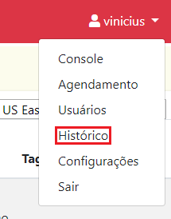

# Histórico

> :sparkles: **Observação**: para mudar o idioma da interface gráfica, utilize a caixa de seleção no canto inferior esquerdo da tela.

Clique no menu no canto superior direito da tela. Então clique em `Histórico`.

A página de histórico apresenta as operações feitas por usuários na EC2 Management.

Em `TIME RANGE`, escolha o perído no qual os logs devem ser buscados.
Por exemplo, nos últimos 7 dias ou de 08/01/2020 às 14:56 até 15/01/2020 às 14:56.

Em `FILTER`, clique no ícone da lupa para realizar a busca.

Clique sobre um dos eventos retornados para vizualizar mais detalhes sobre esse evento.
