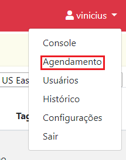

# Agendamento

> :sparkles: **Observação**: para mudar o idioma da interface gráfica, utilize a caixa de seleção no canto inferior esquerdo da tela.

Clique no menu no canto superior direito da tela. Então clique em `Agendamento`.

Agendamentos permitem configurar quando uma ação deve ser executada sobre um ambiente.
Agendamentos são criados sobre intervalos de data e sobre horários específicos.
É possível adicionar exceções para ajustar o agendamento de acordo com o contexto do ambiente.

## Criando um agendamento

1. Clique em `Agendamento`.
2. Em `Nome do ambiente`, selecione o ambiente sobre o qual deseja executar a(s) ação(ões).
3. Digite uma descrição para o agendamento, por exemplo, "Ambiente de produção".
4. Em `Ações`, selecione a ação que deseja executar.
5. Selecione `Meses e dias da semana` ou `Cron Expression`.
   - Caso tenha selecionado `Meses e dias da semana`, marque os dias da semana e os meses nos quais a ação será executada. Então, digite o horário para iniciar a ação.
   - Caso tenha selecionado `Cron Expression`, digite a expresão "cron" que define o intervalo de datas e o horário no qual a ação será executada.
6. Em `Exceções`, caso a ação não deva ser executada em dias de feriado nacional, marque a caixa `Feriados`.
7. Em `Exceções`, caso a ação não deva ser executada em dias específicos:
   - Clique no menu próximo a opção `Dias específicos`.
   - Escolha uma data e clique em `Add`. Clique no `X` próximo a data para remove-lá das exceções.
   - Repita o processo até que todas as datas de exceção estejam adicionadas.
8. Revise a configuração do agendamento e, se tudo estiver como desejado, clique em `Agendar` para criar o agendamento.

[Cron Expressions](https://docs.aws.amazon.com/pt_br/AmazonCloudWatch/latest/events/ScheduledEvents.html#CronExpressions) é um recurso avançado que dá maior flexibilidade na configuração do intervalo de datas do agendamento.

## Editando um agendamento

1. Clique em `Edit` na linha referente ao agendamento que deseja editar.
2. Verifique se _`Environment Name`_ e _`Scheduled to`_ correspondem ao agendamento que deseja editar.
3. Para ativar a exceção em feriados nacionais, clique no botão ao lado de `Holidays`. _Yes_ significa que a exceção está ativa e a ação **não** será executada em dias de feriado nacional.
4. Em `Schedule Expression`, modifique o intervalo de data e hora do agendamento.
5. Em `Exceptions`, para dias específicos:
   - Escolha uma data e clique em `Add`. Clique no `X` próximo a data para remove-lá das exceções.
   - Repita o processo até que todas as datas de exceção estejam adicionadas.
6. Clique em `Confirm` para concluir a edição.

## Removendo um ambiente

1. Clique no `X` na linha referente ao agendamento que deseja remover.
2. Digite `delete` no campo apresentado.
3. Clique em `Delete`.

> :warning: Essa operação não pode ser desfeita.

## Próxima etapa

Gerencie usuários e grupos de usuários na EC2 Management. O passo a passo pode ser encontrado na [Seção 5 - Usuários](../users/USERS.md).
