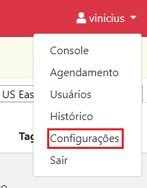
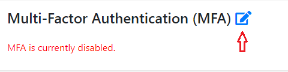

# Configurações

> :sparkles: **Observação**: para mudar o idioma da interface gráfica, utilize a caixa de seleção no canto inferior esquerdo da tela.

Clique no menu no canto superior direito da tela. Então clique em `Configurações`.

## Adicionando credenciais

Acesse sua conta AWS.

Clique nesse [link](https://us-east-1.console.aws.amazon.com/cloudformation/home?region=us-east-1#/stacks/create/review?templateURL=https://s3.amazonaws.com/ec2.manager.infomach/ec2_management_user_setup.yml&stackName=ec2-management&param_RoleName=EC2ManagementRole&param_TrustedAccountId=900397181019) para carregar o script que será executado pelo [AWS CloudFormation](https://docs.aws.amazon.com/pt_br/cloudformation/?id=docs_gateway).
Esse script irá criar a [IAM Role](https://docs.aws.amazon.com/IAM/latest/UserGuide/id_roles.html) que será utilizada pela EC2 Management para manipular as instâncias EC2.

1. Na tela apresentada pelo AWS CloudFormation, deixe os parâmetros preenchidos como estão.
2. Desça a barra de rolagem até o final da página.
3. Marque a caixa que diz _`I acknowledge that AWS CloudFormation might create IAM resources with custom names.`_
4. Clique em `Create stack`.

Espere que o processo de criação da _stack_ seja concluído. Você pode acompanhar o progresso pela aba `Events` apresentada pelo AWS CloudFormation.

1. Após a criação estar completa, vá a aba `Outputs` apresentada pelo AWS CloudFormation.
2. Copie o texto da coluna `Value` na tabela apresentada, por exemplo, `arn:aws:iam::900397181019:role/EC2ManagementRole`.
3. Volte a plataforma EC2 Management. Em `AWS Credenciais -> Salvar Credenciais`, no campo `Role ARN`, cole o texto copiado no passo 2.
4. Clique em `Salvar`.

Se o processo foi bem sucedido, as informações em `AWS Credenciais -> Credenciais armazenadas` serão atualizadas.

## Ativando a autenticação de múltiplos fatores (MFA)

Em `Multi-Factor Authentication (MFA)` clique no ícone com o lápis.

1. Clique em `Enable`.
2. Entre o código gerado no seu aplicativo TOTP, por exemplo, [Google Authenticator](https://play.google.com/store/apps/details?id=com.google.android.apps.authenticator2). Você também poder fazer um scan do QR Code.
3. Digite a senha gerada pelo seu aplicativo TOTP no campo `TOTP verification code` e clique `Verify`.

Se tudo ocorreu como esperado, você será redirecionado para a tela de login. Em seu proximo acesso, um código de verificação MFA será solicitado.

### Desativando o MFA

Para desativar o MFA.
Na mesma tela em que ativou essa funcionalidade, clique em `Disable`. Então, confirme que realmente deseja desabilitar o MFA.

A autenticação de múltiplos fatores pode ser reabilitada a qualquer momento.

## Alterar senha

Digite sua senha antiga. Digite uma nova senha. Repita a senha. Clique em `Alterar senha`.

> Uma senha deve ter pelo menos 8 caracteres e conter pelo menos 1 número, 1 letra maiúscula e 1 letra minúscula.

## Próxima etapa

Crie um ambiente para agrupar e interagir com suas instâncias EC2. O passo a passo pode ser encontrado na [Seção 3 - Console](../console/CONSOLE.md).
