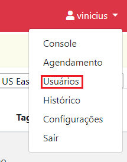

# Usuários

> :sparkles: **Observação**: para mudar o idioma da interface gráfica, utilize a caixa de seleção no canto inferior esquerdo da tela.

Clique no menu no canto superior direito da tela. Então clique em `Usuários`.

Existem dois tipos de usuários na EC2 Management, os que são administradores e os que não são.
Usuários administradores pertencem ao grupo **Admin**.
Usuários não administradores não pertencem a algum grupo ou pertencem a um grupo que não é o **Admin**.

Apenas usuários administradores podem criar, editar e remover recursos na plataforma EC2 Management.
Esses recursos são ambientes, agendamentos, usuários, grupos de usuários e credenciais AWS.

Usuários não administradores podem iniciar, parar e reiniciar ambientes.
Também podem visualizar os agendamentos criados.

## Grupos de usuários

### Criando um grupo de usuários

1. Em `Grupos -> Criar Grupo`, digite o nome do grupo que deseja criar.
2. Clique em `Criar`.

O grupo **Admin** já está reservado para diferenciar usuários administradores de não administradores.

### Removendo um grupo de usuários

1. Em `Grupos -> Deletar Grupo`, digite o nome do grupo que deseja remover.
2. Clique em `Deletar`.

O grupo **Admin** não pode ser removido.

## Usuários

### Criando um usuário:

1. Em `Usuários -> Criar Usuários`, digite o endereço de e-mail do usuário a ser adicionado.
2. Clique em `Criar`.
3. O usuário alvo receberá um e-mail com a senha para acesso a plataforma.

> Usuários recém criados não pertencem a um grupo.

### Editando um usuário

1. Em `Usuários`, clique em `Edit` na linha do usuário que deseja editar.
2. Em `Groups`, selecione o grupo no qual o usuário fará parte.
3. Clique em `Add` para adicionar o usuário ao grupo. Clique no `X` para remover o usuário do grupo.
4. Repita os passos 2 e 3 para todos os grupos que o usuário deve fazer parte.
5. Clique em `Confirm` para salvar as alterações.

### Removendo um usuário

1. Em `Usuários`, clique no `X` na linha do usuário que deseja remover.
2. Confirme a remoção digitando o e-mail do usuário no campo apresentado.
3. Clique em `Delete`.

Usuários removidos podem ser recadastrados como novos usuários.

## Próxima etapa

Visualize ações realizadas na plataforma EC2 Management. O passo a passo pode ser encontrado na [Seção 6 - Histórico](../history/HISTORY.md).
